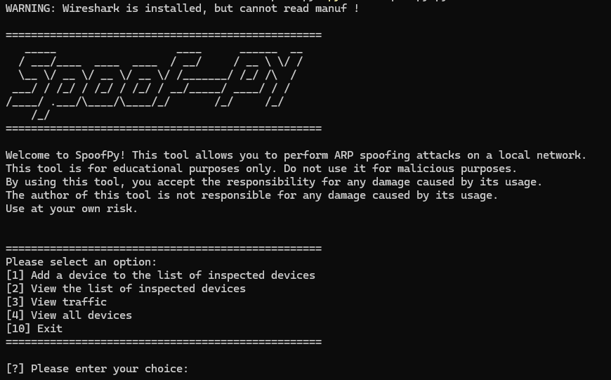

# Arp Spoofing for Python

This is a simple python script to perform arp spoofing. It allows a user to select a target and a gateway and then perform arp spoofing on the target.


### **WARNING: THIS SCRIPT IS FOR EDUCATIONAL PURPOSES ONLY. DO NOT USE IT FOR MALICIOUS PURPOSES.**

## Installation

1. Clone the repository
```bash
git clone https://github.com/blue2cat/spoof-py.git
```

2. Install the required packages
```bash
pip install -r requirements.txt
```

## Usage
Run the script
```bash
python3 spoofpy.py
```

